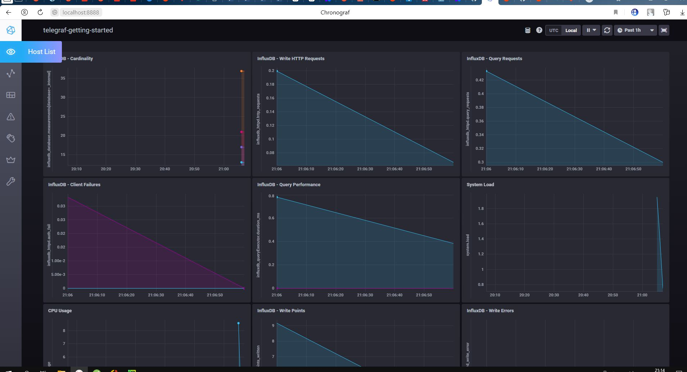
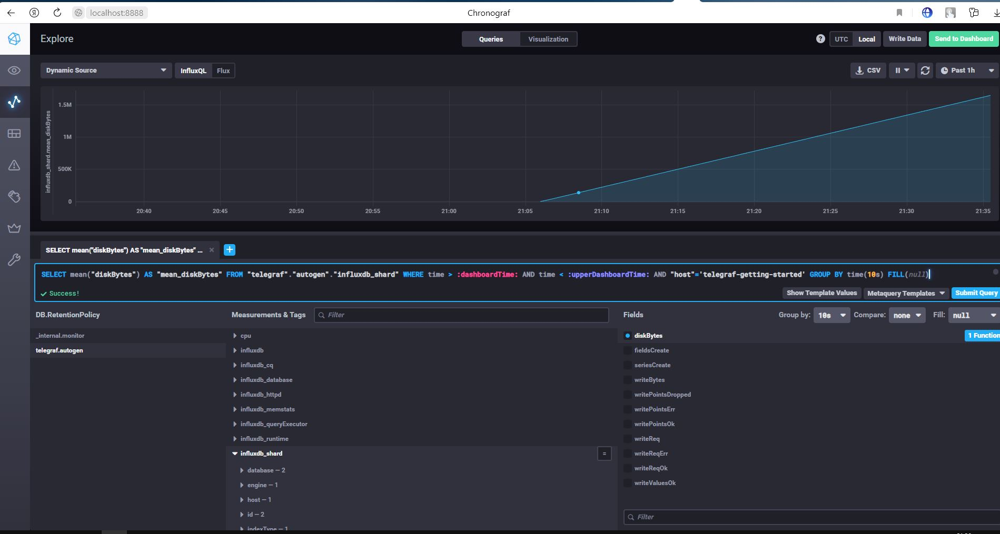
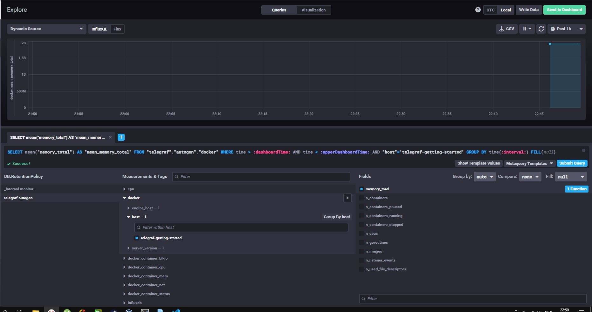

# Домашнее задание к занятию "10.02. Системы мониторинга"

## Обязательные задания

1. Опишите основные плюсы и минусы pull и push систем мониторинга.  

-----------------------------------------------------------
### Pull
#### Плюсы
1. Гарантия получения метрик только с тех хостов, с которых настроен сбор  
2. Возможность установки proxy между системой мониторинга и агента, защита трафика
3. Возможность получения запросов не только из системы мониторинга, но и любого ПО имеющего возможность отправлять и получать http трафик

#### Минусы
1. Невозможность легкой конфигурации кастомных метрик, необходимо создавать экспортер


### PUSH
#### Плюсы
1. Возможность настройки конечной точки получения метрик
2. Гибкая настройка отправки количества данных и частота их настройки
3. Возможность использования UDP что позволяет увеличить скорость получения метрик


#### Минусы  
1. Невозможно контролировать объем получаемых данных, если слишком много агентов будут отправлять данные, возможно перегрузить систему мониторинга
2. Невозможно контролировать подлинность данных


-----------------------------------------------------------


3. Какие из ниже перечисленных систем относятся к push модели, а какие к pull? А может есть гибридные?
-----------------------------------------------------------

| система         | тип          |
|-----------------|--------------|
| Prometheus      | PULL/PUSH    |
| TICK            | Push         |
| Zabbix          | Push/PULL    |
| VictoriaMetrics | Push/Pull |
| Nagios          | Pull|

-----------------------------------------------------------

4. Склонируйте себе [репозиторий](https://github.com/influxdata/sandbox/tree/master) и запустите TICK-стэк, 
используя технологии docker и docker-compose.

В виде решения на это упражнение приведите выводы команд с вашего компьютера (виртуальной машины):

    - curl http://localhost:8086/ping
    - curl http://localhost:8888
    - curl http://localhost:9092/kapacitor/v1/ping


А также скриншот веб-интерфейса ПО chronograf (`http://localhost:8888`). 

P.S.: если при запуске некоторые контейнеры будут падать с ошибкой - проставьте им режим `Z`, например
`./data:/var/lib:Z`
  -----------------------------------------------------------
```shell
$ curl -vvv http://10.10.10.16:8086/ping
*   Trying 10.10.10.16:8086...
  % Total    % Received % Xferd  Average Speed   Time    Time     Time  Current
                                 Dload  Upload   Total   Spent    Left  Speed
  0     0    0     0    0     0      0      0 --:--:-- --:--:-- --:--:--     0* Connected to 10.10.10.16 (10.10.10.16) port 8086 (#0)
> GET /ping HTTP/1.1
> Host: 10.10.10.16:8086
> User-Agent: curl/7.81.0
> Accept: */*
>
* Mark bundle as not supporting multiuse
< HTTP/1.1 204 No Content
< Content-Type: application/json
< Request-Id: d6a35827-09fd-11ed-8340-0242ac190003
< X-Influxdb-Build: OSS
< X-Influxdb-Version: 1.8.10
< X-Request-Id: d6a35827-09fd-11ed-8340-0242ac190003
< Date: Fri, 22 Jul 2022 20:35:35 GMT
<
  0     0    0     0    0     0      0      0 --:--:-- --:--:-- --:--:--     0
* Connection #0 to host 10.10.10.16 left intact
````  

```shell
$ curl -vvv http://10.10.10.16:8888
*   Trying 10.10.10.16:8888...
  % Total    % Received % Xferd  Average Speed   Time    Time     Time  Current
                                 Dload  Upload   Total   Spent    Left  Speed
  0     0    0     0    0     0      0      0 --:--:-- --:--:-- --:--:--     0* Connected to 10.10.10.16 (10.10.10.16) port 8888 (#0)
> GET / HTTP/1.1
> Host: 10.10.10.16:8888
> User-Agent: curl/7.81.0
> Accept: */*
>
* Mark bundle as not supporting multiuse
< HTTP/1.1 200 OK
< Accept-Ranges: bytes
< Cache-Control: public, max-age=3600
< Content-Length: 336
< Content-Security-Policy: script-src 'self'; object-src 'self'
< Content-Type: text/html; charset=utf-8
< Etag: "3362220244"
< Last-Modified: Tue, 22 Mar 2022 20:02:44 GMT
< Vary: Accept-Encoding
< X-Chronograf-Version: 1.9.4
< X-Content-Type-Options: nosniff
< X-Frame-Options: SAMEORIGIN
< X-Xss-Protection: 1; mode=block
< Date: Fri, 22 Jul 2022 20:36:45 GMT
<
{ [336 bytes data]
100   336  100   336    0     0   102k      0 --:--:-- --:--:-- --:--:--  164k<!DOCTYPE html><html><head><meta http-equiv="Content-type" content="text/html; charset=utf-8"><title>Chronograf</title><link rel="icon shortcut" href="/favicon.fa749080.ico"><link rel="stylesheet" href="/src.9cea3e4e.css"></head><body> <div id="react-root" data-basepath=""></div> <script src="/src.a969287c.js"></script> </body></html>
* Connection #0 to host 10.10.10.16 left intact

````  
````shell
$ curl -vvv http://10.10.10.16:9092/kapacitor/v1/ping
*   Trying 10.10.10.16:9092...
  % Total    % Received % Xferd  Average Speed   Time    Time     Time  Current
                                 Dload  Upload   Total   Spent    Left  Speed
  0     0    0     0    0     0      0      0 --:--:-- --:--:-- --:--:--     0* Connected to 10.10.10.16 (10.10.10.16) port 9092 (#0)
> GET /kapacitor/v1/ping HTTP/1.1
> Host: 10.10.10.16:9092
> User-Agent: curl/7.81.0
> Accept: */*
>
* Mark bundle as not supporting multiuse
< HTTP/1.1 204 No Content
< Content-Type: application/json; charset=utf-8
< Request-Id: 1bc0c757-09fe-11ed-8366-000000000000
< X-Kapacitor-Version: 1.6.4
< Date: Fri, 22 Jul 2022 20:37:31 GMT
<
  0     0    0     0    0     0      0      0 --:--:-- --:--:-- --:--:--     0
* Connection #0 to host 10.10.10.16 left intact


````
 
-----------------------------------------------------------
4. Перейдите в веб-интерфейс Chronograf (`http://localhost:8888`) и откройте вкладку `Data explorer`.

    - Нажмите на кнопку `Add a query`
    - Изучите вывод интерфейса и выберите БД `telegraf.autogen`
    - В `measurments` выберите mem->host->telegraf_container_id , а в `fields` выберите used_percent. 
    Внизу появится график утилизации оперативной памяти в контейнере telegraf.
    - Вверху вы можете увидеть запрос, аналогичный SQL-синтаксису. 
    Поэкспериментируйте с запросом, попробуйте изменить группировку и интервал наблюдений.

Для выполнения задания приведите скриншот с отображением метрик утилизации места на диске 
(disk->host->telegraf_container_id) из веб-интерфейса.  
-----------------------------------------------------------

 
-----------------------------------------------------------
5. Изучите список [telegraf inputs](https://github.com/influxdata/telegraf/tree/master/plugins/inputs). 
Добавьте в конфигурацию telegraf следующий плагин - [docker](https://github.com/influxdata/telegraf/tree/master/plugins/inputs/docker):
```
[[inputs.docker]]
  endpoint = "unix:///var/run/docker.sock"
```

Дополнительно вам может потребоваться донастройка контейнера telegraf в `docker-compose.yml` дополнительного volume и 
режима privileged:
```
  telegraf:
    image: telegraf:1.4.0
    privileged: true
    volumes:
      - ./etc/telegraf.conf:/etc/telegraf/telegraf.conf:Z
      - /var/run/docker.sock:/var/run/docker.sock:Z
    links:
      - influxdb
    ports:
      - "8092:8092/udp"
      - "8094:8094"
      - "8125:8125/udp"
```

После настройке перезапустите telegraf, обновите веб интерфейс и приведите скриншотом список `measurments` в 
веб-интерфейсе базы telegraf.autogen . Там должны появиться метрики, связанные с docker.

Факультативно можете изучить какие метрики собирает telegraf после выполнения данного задания.  
-----------------------------------------------------------

 
-----------------------------------------------------------
## Дополнительное задание (со звездочкой*) - необязательно к выполнению

В веб-интерфейсе откройте вкладку `Dashboards`. Попробуйте создать свой dashboard с отображением:

    - утилизации ЦПУ
    - количества использованного RAM
    - утилизации пространства на дисках
    - количество поднятых контейнеров
    - аптайм
    - ...
    - фантазируйте)
    
    ---

### Как оформить ДЗ?

Выполненное домашнее задание пришлите ссылкой на .md-файл в вашем репозитории.

---
