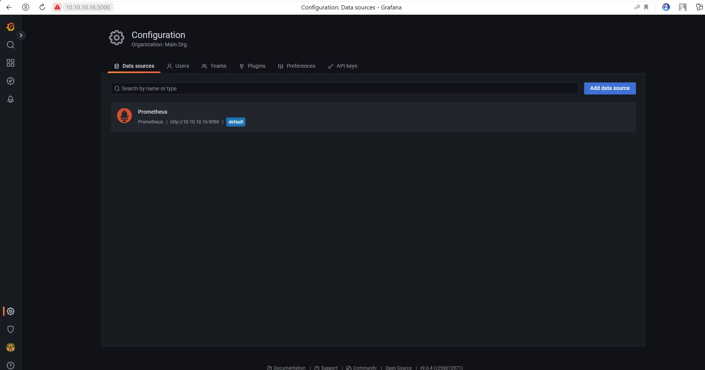

# Домашнее задание к занятию "10.03. Grafana"

## Задание повышенной сложности

**В части задания 1** не используйте директорию [help](./help) для сборки проекта, самостоятельно разверните grafana, где в 
роли источника данных будет выступать prometheus, а сборщиком данных node-exporter:
- grafana
- prometheus-server
- prometheus node-exporter

За дополнительными материалами, вы можете обратиться в официальную документацию grafana и prometheus.

В решении к домашнему заданию приведите также все конфигурации/скрипты/манифесты, которые вы 
использовали в процессе решения задания.

**В части задания 3** вы должны самостоятельно завести удобный для вас канал нотификации, например Telegram или Email
и отправить туда тестовые события.

В решении приведите скриншоты тестовых событий из каналов нотификаций.

## Обязательные задания

### Задание 1
Используя директорию [help](./help) внутри данного домашнего задания - запустите связку prometheus-grafana.

Зайдите в веб-интерфейс графана, используя авторизационные данные, указанные в манифесте docker-compose.

Подключите поднятый вами prometheus как источник данных.

Решение домашнего задания - скриншот веб-интерфейса grafana со списком подключенных Datasource.  

____________________________________________

 

## Задание 2
Изучите самостоятельно ресурсы:
- [promql-for-humans](https://timber.io/blog/promql-for-humans/#cpu-usage-by-instance)
- [understanding prometheus cpu metrics](https://www.robustperception.io/understanding-machine-cpu-usage)

Создайте Dashboard и в ней создайте следующие Panels:
- Утилизация CPU для nodeexporter (в процентах, 100-idle)
- CPULA 1/5/15
- Количество свободной оперативной памяти
- Количество места на файловой системе

Для решения данного ДЗ приведите promql запросы для выдачи этих метрик, а также скриншот получившейся Dashboard.  

__________________________________________  

| метрика         | запрос    |
|-----------------|-----------|
| Утилизация CPU для nodeexporter (в процентах, 100-idle)      | 100 - ((irate(node_cpu_seconds_total{instance="localhost:9100",mode="idle"}[1m])) * 100) |
| CPULA 1/5/15            | node_load1{instance="localhost:9100"}<br/>node_load5{instance="localhost:9100"}<br/>node_load15{instance="localhost:9100"}      |
| Количество свободной оперативной памяти          | node_memory_MemFree_bytes{instance="localhost:9100"}/1024/1024/1024 |
| Количество места на файловой системе | node_filesystem_free_bytes{instance="localhost:9100"}/1024/1024/1024 |


 

## Задание 3
Создайте для каждой Dashboard подходящее правило alert (можно обратиться к первой лекции в блоке "Мониторинг").

Для решения ДЗ - приведите скриншот вашей итоговой Dashboard.  

_________________________________________________________________


## Задание 4
Сохраните ваш Dashboard.

Для этого перейдите в настройки Dashboard, выберите в боковом меню "JSON MODEL".

Далее скопируйте отображаемое json-содержимое в отдельный файл и сохраните его.

В решении задания - приведите листинг этого файла.  

---

```json
{
	"annotations": {
		"list": [
			{
				"builtIn": 1,
				"datasource": {
					"type": "grafana",
					"uid": "-- Grafana --"
				},
				"enable": true,
				"hide": true,
				"iconColor": "rgba(0, 211, 255, 1)",
				"name": "Annotations & Alerts",
				"target": {
					"limit": 100,
					"matchAny": false,
					"tags": [],
					"type": "dashboard"
				},
				"type": "dashboard"
			}
		]
	},
	"editable": true,
	"fiscalYearStartMonth": 0,
	"graphTooltip": 0,
	"id": 1,
	"links": [],
	"liveNow": false,
	"panels": [
		{
			"datasource": {
				"type": "prometheus",
				"uid": "aBOhQsgVz"
			},
			"fieldConfig": {
				"defaults": {
					"color": {
						"mode": "thresholds"
					},
					"decimals": 2,
					"mappings": [],
					"thresholds": {
						"mode": "absolute",
						"steps": [
							{
								"color": "dark-green",
								"value": null
							},
							{
								"color": "red",
								"value": 10
							},
							{
								"color": "#EAB839",
								"value": 50
							},
							{
								"color": "dark-green",
								"value": 80
							}
						]
					},
					"unit": "short"
				},
				"overrides": []
			},
			"gridPos": {
				"h": 7,
				"w": 7,
				"x": 0,
				"y": 0
			},
			"id": 4,
			"options": {
				"colorMode": "value",
				"graphMode": "none",
				"justifyMode": "center",
				"orientation": "auto",
				"reduceOptions": {
					"calcs": [
						"last"
					],
					"fields": "",
					"values": false
				},
				"textMode": "auto"
			},
			"pluginVersion": "9.0.4",
			"targets": [
				{
					"datasource": {
						"type": "prometheus",
						"uid": "aBOhQsgVz"
					},
					"editorMode": "code",
					"exemplar": false,
					"expr": "node_load1{instance=\"localhost:9100\"}",
					"hide": false,
					"legendFormat": "CPULA - 1m",
					"range": true,
					"refId": "B"
				},
				{
					"datasource": {
						"type": "prometheus",
						"uid": "aBOhQsgVz"
					},
					"editorMode": "code",
					"exemplar": false,
					"expr": "node_load5{instance=\"localhost:9100\"}",
					"hide": false,
					"legendFormat": "CPULA - 5m",
					"range": true,
					"refId": "A"
				},
				{
					"datasource": {
						"type": "prometheus",
						"uid": "aBOhQsgVz"
					},
					"editorMode": "code",
					"exemplar": false,
					"expr": "node_load15{instance=\"localhost:9100\"}",
					"hide": false,
					"legendFormat": "CPULA - 15m",
					"range": true,
					"refId": "C"
				}
			],
			"title": "CPU Load Average",
			"type": "stat"
		},
		{
			"datasource": {
				"type": "prometheus",
				"uid": "aBOhQsgVz"
			},
			"fieldConfig": {
				"defaults": {
					"color": {
						"mode": "thresholds"
					},
					"mappings": [],
					"thresholds": {
						"mode": "percentage",
						"steps": [
							{
								"color": "green",
								"value": null
							},
							{
								"color": "red",
								"value": 20
							},
							{
								"color": "#EAB839",
								"value": 50
							},
							{
								"color": "dark-green",
								"value": 90
							}
						]
					},
					"unit": "percent"
				},
				"overrides": []
			},
			"gridPos": {
				"h": 7,
				"w": 8,
				"x": 7,
				"y": 0
			},
			"id": 9,
			"options": {
				"colorMode": "value",
				"graphMode": "none",
				"justifyMode": "center",
				"orientation": "auto",
				"reduceOptions": {
					"calcs": [
						"lastNotNull"
					],
					"fields": "",
					"values": false
				},
				"textMode": "auto"
			},
			"pluginVersion": "9.0.4",
			"targets": [
				{
					"datasource": {
						"type": "prometheus",
						"uid": "aBOhQsgVz"
					},
					"editorMode": "code",
					"expr": "(node_memory_MemFree_bytes{instance=\"localhost:9100\"}/1024/1024/1024) / (node_memory_MemTotal_bytes{instance=\"localhost:9100\"}/1024/1024/1024) * 100",
					"legendFormat": "{{instance}}",
					"range": true,
					"refId": "A"
				}
			],
			"title": "Free RAM %",
			"type": "stat"
		},
		{
			"datasource": {
				"type": "prometheus",
				"uid": "aBOhQsgVz"
			},
			"fieldConfig": {
				"defaults": {
					"color": {
						"mode": "thresholds"
					},
					"mappings": [],
					"thresholds": {
						"mode": "absolute",
						"steps": [
							{
								"color": "green",
								"value": null
							},
							{
								"color": "dark-red",
								"value": 10
							},
							{
								"color": "dark-yellow",
								"value": 50
							},
							{
								"color": "dark-green",
								"value": 90
							}
						]
					},
					"unit": "percent"
				},
				"overrides": []
			},
			"gridPos": {
				"h": 7,
				"w": 9,
				"x": 15,
				"y": 0
			},
			"id": 8,
			"options": {
				"orientation": "auto",
				"reduceOptions": {
					"calcs": [
						"lastNotNull"
					],
					"fields": "",
					"values": false
				},
				"showThresholdLabels": false,
				"showThresholdMarkers": true
			},
			"pluginVersion": "9.0.4",
			"targets": [
				{
					"datasource": {
						"type": "prometheus",
						"uid": "aBOhQsgVz"
					},
					"editorMode": "code",
					"expr": "node_filesystem_free_bytes{instance=\"localhost:9100\"}/1024/1024/1024",
					"hide": true,
					"legendFormat": "{{device}}{{mountpoint}}",
					"range": true,
					"refId": "A"
				},
				{
					"datasource": {
						"type": "prometheus",
						"uid": "aBOhQsgVz"
					},
					"editorMode": "code",
					"expr": "(node_filesystem_free_bytes{instance=\"localhost:9100\"}/1024/1024/1024) / (node_filesystem_size_bytes{instance=\"localhost:9100\"}/1024/1024/1024) * 100",
					"hide": false,
					"legendFormat": "{{device}}{{mountpoint}}",
					"range": true,
					"refId": "B"
				}
			],
			"title": "Free FS Size %",
			"type": "gauge"
		},
		{
			"datasource": {
				"type": "prometheus",
				"uid": "aBOhQsgVz"
			},
			"fieldConfig": {
				"defaults": {
					"color": {
						"mode": "palette-classic"
					},
					"custom": {
						"axisLabel": "",
						"axisPlacement": "auto",
						"barAlignment": 0,
						"drawStyle": "line",
						"fillOpacity": 0,
						"gradientMode": "none",
						"hideFrom": {
							"legend": false,
							"tooltip": false,
							"viz": false
						},
						"lineInterpolation": "linear",
						"lineWidth": 1,
						"pointSize": 5,
						"scaleDistribution": {
							"type": "linear"
						},
						"showPoints": "auto",
						"spanNulls": false,
						"stacking": {
							"group": "A",
							"mode": "none"
						},
						"thresholdsStyle": {
							"mode": "off"
						}
					},
					"decimals": 2,
					"mappings": [],
					"thresholds": {
						"mode": "absolute",
						"steps": [
							{
								"color": "dark-green",
								"value": null
							},
							{
								"color": "red",
								"value": 10
							},
							{
								"color": "#EAB839",
								"value": 50
							},
							{
								"color": "dark-green",
								"value": 80
							}
						]
					},
					"unit": "short"
				},
				"overrides": []
			},
			"gridPos": {
				"h": 7,
				"w": 7,
				"x": 0,
				"y": 7
			},
			"id": 10,
			"options": {
				"legend": {
					"calcs": [],
					"displayMode": "list",
					"placement": "bottom"
				},
				"tooltip": {
					"mode": "single",
					"sort": "none"
				}
			},
			"pluginVersion": "9.0.4",
			"targets": [
				{
					"datasource": {
						"type": "prometheus",
						"uid": "aBOhQsgVz"
					},
					"editorMode": "code",
					"exemplar": false,
					"expr": "node_load1{instance=\"localhost:9100\"}",
					"hide": false,
					"legendFormat": "CPULA - 1m",
					"range": true,
					"refId": "B"
				}
			],
			"title": "CPU Load Average 1m",
			"type": "timeseries"
		},
		{
			"datasource": {
				"type": "prometheus",
				"uid": "aBOhQsgVz"
			},
			"fieldConfig": {
				"defaults": {
					"color": {
						"mode": "palette-classic"
					},
					"custom": {
						"axisLabel": "",
						"axisPlacement": "auto",
						"barAlignment": 0,
						"drawStyle": "line",
						"fillOpacity": 0,
						"gradientMode": "none",
						"hideFrom": {
							"legend": false,
							"tooltip": false,
							"viz": false
						},
						"lineInterpolation": "linear",
						"lineWidth": 1,
						"pointSize": 5,
						"scaleDistribution": {
							"type": "linear"
						},
						"showPoints": "auto",
						"spanNulls": false,
						"stacking": {
							"group": "A",
							"mode": "none"
						},
						"thresholdsStyle": {
							"mode": "off"
						}
					},
					"decimals": 2,
					"mappings": [],
					"thresholds": {
						"mode": "absolute",
						"steps": [
							{
								"color": "dark-green",
								"value": null
							},
							{
								"color": "red",
								"value": 10
							},
							{
								"color": "#EAB839",
								"value": 50
							},
							{
								"color": "dark-green",
								"value": 80
							}
						]
					},
					"unit": "short"
				},
				"overrides": []
			},
			"gridPos": {
				"h": 7,
				"w": 8,
				"x": 7,
				"y": 7
			},
			"id": 11,
			"options": {
				"legend": {
					"calcs": [],
					"displayMode": "list",
					"placement": "bottom"
				},
				"tooltip": {
					"mode": "single",
					"sort": "none"
				}
			},
			"pluginVersion": "9.0.4",
			"targets": [
				{
					"datasource": {
						"type": "prometheus",
						"uid": "aBOhQsgVz"
					},
					"editorMode": "code",
					"exemplar": false,
					"expr": "node_load1{instance=\"localhost:9100\"}",
					"hide": false,
					"legendFormat": "CPULA - 1m",
					"range": true,
					"refId": "B"
				}
			],
			"title": "CPU Load Average 5m",
			"type": "timeseries"
		},
		{
			"datasource": {
				"type": "prometheus",
				"uid": "aBOhQsgVz"
			},
			"fieldConfig": {
				"defaults": {
					"color": {
						"mode": "palette-classic"
					},
					"custom": {
						"axisLabel": "",
						"axisPlacement": "auto",
						"barAlignment": 0,
						"drawStyle": "line",
						"fillOpacity": 0,
						"gradientMode": "none",
						"hideFrom": {
							"legend": false,
							"tooltip": false,
							"viz": false
						},
						"lineInterpolation": "linear",
						"lineWidth": 1,
						"pointSize": 5,
						"scaleDistribution": {
							"type": "linear"
						},
						"showPoints": "auto",
						"spanNulls": false,
						"stacking": {
							"group": "A",
							"mode": "none"
						},
						"thresholdsStyle": {
							"mode": "off"
						}
					},
					"decimals": 2,
					"mappings": [],
					"thresholds": {
						"mode": "absolute",
						"steps": [
							{
								"color": "dark-green",
								"value": null
							},
							{
								"color": "red",
								"value": 10
							},
							{
								"color": "#EAB839",
								"value": 50
							},
							{
								"color": "dark-green",
								"value": 80
							}
						]
					},
					"unit": "short"
				},
				"overrides": []
			},
			"gridPos": {
				"h": 7,
				"w": 9,
				"x": 15,
				"y": 7
			},
			"id": 12,
			"options": {
				"legend": {
					"calcs": [],
					"displayMode": "list",
					"placement": "bottom"
				},
				"tooltip": {
					"mode": "single",
					"sort": "none"
				}
			},
			"pluginVersion": "9.0.4",
			"targets": [
				{
					"datasource": {
						"type": "prometheus",
						"uid": "aBOhQsgVz"
					},
					"editorMode": "code",
					"exemplar": false,
					"expr": "node_load1{instance=\"localhost:9100\"}",
					"hide": false,
					"legendFormat": "CPULA - 1m",
					"range": true,
					"refId": "B"
				}
			],
			"title": "CPU Load Average 1m",
			"type": "timeseries"
		},
		{
			"datasource": {
				"type": "prometheus",
				"uid": "aBOhQsgVz"
			},
			"fieldConfig": {
				"defaults": {
					"color": {
						"mode": "palette-classic"
					},
					"custom": {
						"axisLabel": "",
						"axisPlacement": "auto",
						"barAlignment": 0,
						"drawStyle": "line",
						"fillOpacity": 0,
						"gradientMode": "none",
						"hideFrom": {
							"legend": false,
							"tooltip": false,
							"viz": false
						},
						"lineInterpolation": "linear",
						"lineWidth": 1,
						"pointSize": 5,
						"scaleDistribution": {
							"type": "linear"
						},
						"showPoints": "auto",
						"spanNulls": false,
						"stacking": {
							"group": "A",
							"mode": "none"
						},
						"thresholdsStyle": {
							"mode": "off"
						}
					},
					"mappings": [],
					"thresholds": {
						"mode": "absolute",
						"steps": [
							{
								"color": "dark-green",
								"value": null
							},
							{
								"color": "red",
								"value": 10
							},
							{
								"color": "#EAB839",
								"value": 50
							},
							{
								"color": "dark-green",
								"value": 80
							}
						]
					},
					"unit": "short"
				},
				"overrides": []
			},
			"gridPos": {
				"h": 7,
				"w": 7,
				"x": 0,
				"y": 14
			},
			"id": 3,
			"options": {
				"legend": {
					"calcs": [],
					"displayMode": "list",
					"placement": "bottom"
				},
				"tooltip": {
					"mode": "single",
					"sort": "none"
				}
			},
			"pluginVersion": "9.0.4",
			"targets": [
				{
					"datasource": {
						"type": "prometheus",
						"uid": "aBOhQsgVz"
					},
					"editorMode": "code",
					"exemplar": false,
					"expr": "100 - ((irate(node_cpu_seconds_total{instance=\"localhost:9100\",mode=\"idle\"}[1m])) * 100)",
					"hide": false,
					"legendFormat": "{{instance}} ",
					"range": true,
					"refId": "B"
				}
			],
			"title": "CPU Utilization",
			"type": "timeseries"
		},
		{
			"datasource": {
				"type": "prometheus",
				"uid": "aBOhQsgVz"
			},
			"fieldConfig": {
				"defaults": {
					"color": {
						"mode": "palette-classic"
					},
					"custom": {
						"axisLabel": "",
						"axisPlacement": "auto",
						"barAlignment": 0,
						"drawStyle": "line",
						"fillOpacity": 0,
						"gradientMode": "none",
						"hideFrom": {
							"legend": false,
							"tooltip": false,
							"viz": false
						},
						"lineInterpolation": "linear",
						"lineWidth": 1,
						"pointSize": 5,
						"scaleDistribution": {
							"type": "linear"
						},
						"showPoints": "auto",
						"spanNulls": false,
						"stacking": {
							"group": "A",
							"mode": "none"
						},
						"thresholdsStyle": {
							"mode": "off"
						}
					},
					"mappings": [],
					"thresholds": {
						"mode": "absolute",
						"steps": [
							{
								"color": "green",
								"value": null
							},
							{
								"color": "red",
								"value": 80
							}
						]
					}
				},
				"overrides": []
			},
			"gridPos": {
				"h": 7,
				"w": 8,
				"x": 7,
				"y": 14
			},
			"id": 6,
			"options": {
				"legend": {
					"calcs": [],
					"displayMode": "list",
					"placement": "bottom"
				},
				"tooltip": {
					"mode": "single",
					"sort": "none"
				}
			},
			"targets": [
				{
					"datasource": {
						"type": "prometheus",
						"uid": "aBOhQsgVz"
					},
					"editorMode": "code",
					"expr": "node_memory_MemFree_bytes{instance=\"localhost:9100\"}/1024/1024/1024",
					"legendFormat": "{{instance}}",
					"range": true,
					"refId": "A"
				}
			],
			"title": "Free RAM GB",
			"type": "timeseries"
		},
		{
			"datasource": {
				"type": "prometheus",
				"uid": "aBOhQsgVz"
			},
			"fieldConfig": {
				"defaults": {
					"color": {
						"mode": "palette-classic"
					},
					"custom": {
						"axisLabel": "",
						"axisPlacement": "auto",
						"barAlignment": 0,
						"drawStyle": "line",
						"fillOpacity": 0,
						"gradientMode": "none",
						"hideFrom": {
							"legend": false,
							"tooltip": false,
							"viz": false
						},
						"lineInterpolation": "linear",
						"lineWidth": 1,
						"pointSize": 5,
						"scaleDistribution": {
							"type": "linear"
						},
						"showPoints": "auto",
						"spanNulls": false,
						"stacking": {
							"group": "A",
							"mode": "none"
						},
						"thresholdsStyle": {
							"mode": "off"
						}
					},
					"mappings": [],
					"thresholds": {
						"mode": "absolute",
						"steps": [
							{
								"color": "green",
								"value": null
							},
							{
								"color": "red",
								"value": 80
							}
						]
					}
				},
				"overrides": []
			},
			"gridPos": {
				"h": 7,
				"w": 9,
				"x": 15,
				"y": 14
			},
			"id": 7,
			"options": {
				"legend": {
					"calcs": [],
					"displayMode": "list",
					"placement": "bottom"
				},
				"tooltip": {
					"mode": "single",
					"sort": "none"
				}
			},
			"targets": [
				{
					"datasource": {
						"type": "prometheus",
						"uid": "aBOhQsgVz"
					},
					"editorMode": "code",
					"expr": "node_filesystem_free_bytes{instance=\"localhost:9100\"}/1024/1024/1024",
					"legendFormat": "{{device}}",
					"range": true,
					"refId": "A"
				}
			],
			"title": "Free FS Size GB",
			"type": "timeseries"
		}
	],
	"schemaVersion": 36,
	"style": "dark",
	"tags": [],
	"templating": {
		"list": []
	},
	"time": {
		"from": "now-5m",
		"to": "now"
	},
	"timepicker": {},
	"timezone": "",
	"title": "dashboard",
	"uid": "HGFRFUg4k",
	"version": 6,
	"weekStart": ""
}

```

---

### Как оформить ДЗ?

Выполненное домашнее задание пришлите ссылкой на .md-файл в вашем репозитории.

---